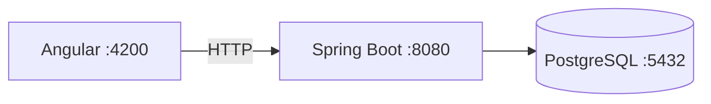

# Computer Store

MVP local de una tienda de productos informaticos y servicio tecnico. El proyecto demuestra una arquitectura de monolito modular con Angular, Spring Boot y PostgreSQL.

## Estado

El MVP funcional incluye autenticacion con roles, catalogo, inventario, reservas de stock, solicitudes de pedido y tickets de servicio tecnico. Mercado Pago Checkout Pro esta implementado pero deshabilitado por defecto; la cotizacion de envios aun no esta implementada.

See [payment and shipping integration](docs/payment-and-shipping-integration.md) for the payment flow, [production checklist](docs/production-checklist.md) for release gates and [production deployment](docs/production-deployment.md) for the VPS runbook.

## Stack

| Technology | Version |
|---|---:|
| Java | 21 LTS |
| Spring Boot | 3.5.16 |
| Angular | 21.2.18 |
| Node.js | 24.15.0 |
| PostgreSQL | 17.10 |

## Architecture



See [docs/architecture.md](docs/architecture.md) for the initial architecture decisions.

## Repository structure

```text
computer-store/
├── frontend/       # Angular standalone application
├── backend/        # Spring Boot API
├── docs/           # Technical documentation
├── docker-compose.yml
├── .env.example
├── README.md
└── CONTRIBUTING.md
```

## Prerequisites

- Docker Desktop with Docker Compose.
- Java 21 LTS.
- Node.js 24.15.0 and npm 11.12.1.

Windows Java installation:

```powershell
winget install --id EclipseAdoptium.Temurin.21.JDK -e
java -version
```

Linux (Debian/Ubuntu):

```bash
sudo apt update
sudo apt install openjdk-21-jdk
java -version
```

## Local Docker stack

The default Docker Compose file builds the Angular storefront, starts PostgreSQL and runs the backend with the `prod` profile for local evaluation. Copy `.env.example` to `.env`, set local credentials and configure the intended origin. Startup fails if any required value is absent. This stack is not the public VPS deployment.

```bash
docker compose up -d --build
docker compose ps
```

```powershell
docker compose up -d --build
docker compose ps
```

The storefront is available at `http://localhost:${FRONTEND_PORT:-80}` and proxies `/api` to the backend container. The API is also bound to `127.0.0.1:${BACKEND_PORT:-8080}` so the Angular development server can use it without exposing it to the network. Seeder accounts, OpenAPI documents and Swagger UI are disabled in `prod`.

## Production VPS deployment

`docker-compose.prod.yml` never builds on the server. It requires registry images pinned by
digest, exposes only Caddy on 80/443, obtains HTTPS automatically and isolates application
and data networks. Use `.env.production.example` only as a template for a root-owned
`0600` file outside the repository.

Do not run the production stack by copying example values or using floating tags. Follow
the full [VPS deployment runbook](docs/production-deployment.md) and complete the
[production checklist](docs/production-checklist.md); these files provide controls and
procedures but do not certify the application as production-ready.

## Manual startup

1. Export the datasource variables shown below, or run PostgreSQL with local credentials of your choice.
2. Start PostgreSQL only:

```bash
docker compose up -d postgres
```

```powershell
docker compose up -d postgres
```

3. Start the backend with the development profile and local datasource variables:

```bash
cd backend
SPRING_PROFILES_ACTIVE=dev SPRING_DATASOURCE_URL=jdbc:postgresql://localhost:5432/computer_store SPRING_DATASOURCE_USERNAME=computer_store SPRING_DATASOURCE_PASSWORD=computer_store ./mvnw spring-boot:run
```

```powershell
cd backend
$env:SPRING_PROFILES_ACTIVE="dev"; $env:SPRING_DATASOURCE_URL="jdbc:postgresql://localhost:5432/computer_store"; $env:SPRING_DATASOURCE_USERNAME="computer_store"; $env:SPRING_DATASOURCE_PASSWORD="computer_store"; .\mvnw.cmd spring-boot:run
```

4. Start Angular in a second terminal:

```bash
cd frontend
npm install
npm start
```

```powershell
cd frontend
npm install
npm start
```

Open `http://localhost:4200`. The home page checks `GET /api/health` through the real API.

## Database and Flyway

Flyway executes `backend/src/main/resources/db/migration/V1__create_initial_schema.sql` automatically from an empty database. Hibernate is configured with `ddl-auto: validate`; it never creates or changes the schema.

## Order reservations

`POST /api/orders` accepts an optional `Idempotency-Key` header (1-100 characters). The storefront creates and persists this key while a checkout attempt is pending. Repeating the same key for the same user and payload returns the original order; reusing it with another payload returns `409`. Omitting the header preserves compatibility for other API clients.

Stock is reserved for `ORDER_RESERVATION_TTL` (15 minutes by default) while an order is pending. Expired reservations are cancelled and released automatically. Mercado Pago Checkout Pro creates an expiring hosted checkout for that reservation. Only a signed webhook followed by an authoritative provider lookup can approve the order; browser return parameters are never trusted. A payment received after stock was released is refunded idempotently.

## Mercado Pago Checkout Pro

The integration is disabled by default. Copy `.env.example` to `.env` and configure the sandbox values before enabling it:

```env
MP_ENABLED=true
MP_ENVIRONMENT=sandbox
MP_ACCESS_TOKEN=TEST-your-sandbox-access-token
MP_WEBHOOK_SECRET=your-webhook-signature-secret
MP_COLLECTOR_ID=your-test-seller-user-id
PUBLIC_BASE_URL=https://your-public-tunnel.example
```

`PUBLIC_BASE_URL` must be an HTTPS URL that exposes the storefront and `/api`. Configure this notification URL in the Mercado Pago application:

```text
https://your-public-tunnel.example/api/payments/webhooks/mercado-pago
```

Docker Compose reads `.env` automatically. To use `.env.local` explicitly, start it with `docker compose --env-file .env.local up -d --build`. Neither private file is versioned. Checkout Pro does not require a Mercado Pago public key or JavaScript SDK in Angular.

## Product and technical-service images

Administrators can upload up to six optional JPEG/PNG images per product. Customers and technicians can attach up to ten optional JPEG/PNG images to each technical-service ticket. Files are validated from their decoded content, limited to 5 MiB and stored under generated UUIDs rather than user-provided filenames.

Product images are public. Ticket attachments are private and downloaded through authenticated API requests with ticket ownership and role checks. Docker persists files in the `media_uploads` volume mounted at `/app/uploads`; manual backend runs use `FILE_STORAGE_ROOT` (default `./uploads`). Back up this storage together with PostgreSQL. Use managed object storage before horizontally scaling the backend.

To reset local data, stop and remove the PostgreSQL volume:

```bash
docker compose down -v
docker compose up -d --build
```

```powershell
docker compose down -v
docker compose up -d --build
```

## Verification

Backend:

```bash
cd backend
./mvnw clean verify
```

Windows:

```powershell
cd backend
.\mvnw.cmd clean verify
```

Frontend:

```bash
cd frontend
npm install
npm test -- --watch=false
npm run build
```

## Security baseline

- No real credentials or secrets are versioned.
- CORS permits only `http://localhost:4200` by default.
- Catalog, health y autenticacion son publicos; los demas endpoints requieren autenticacion y el stock exacto solo esta disponible para administradores y tecnicos.
- Error responses use RFC 9457 `ProblemDetail` without stack traces.
- Access tokens de corta duracion se mantienen solo en memoria; el frontend renueva la sesion una vez ante un 401 usando refresh tokens rotativos en cookies `HttpOnly`.
- Login y refresh tienen limites de intentos en memoria configurables mediante `AUTH_MAX_LOGIN_ATTEMPTS`, `AUTH_MAX_REFRESH_ATTEMPTS` y `AUTH_RATE_LIMIT_WINDOW_MS`.

## Development users

These accounts are seeded only in the `dev` profile. Do not use their passwords outside local development.

| Role | Email | Password |
|---|---|---|
| Administrator | `admin@computerstore.local` | `Admin123!` |
| Technician | `technician@computerstore.local` | `Technician123!` |
| Customer | `customer@computerstore.local` | `Customer123!` |

## Architecture decisions

- A modular monolith reduces operational complexity for the MVP.
- Backend code is organized by feature.
- PostgreSQL fits the relational domain.
- Flyway owns schema changes.
- Los precios se recalculan siempre en el backend.
- Las ordenes retienen snapshots de nombre y precio del producto.
- Los movimientos de inventario retienen trazabilidad.
- Spring Security protects API endpoints; Angular guards are not a security boundary.
- Las contrasenas se almacenan usando BCrypt y los refresh tokens se almacenan como hashes SHA-256.

## Roadmap

- Etapa 2: authentication, roles and JWT refresh flow. Implementada.
- Etapa 3: catalog, products, inventory and seed data. Implementada.
- Etapa 4: cart and order management. Implementada.
- Etapa 5: technical service tickets. Implementada.
- Etapa 6: ampliar pruebas de integracion, linting y pulido visual. En progreso.

## Screenshots

Pendiente de incorporar capturas actualizadas del catalogo, administracion y servicio tecnico.

## Team

- Pendiente de completar por el equipo del proyecto.
