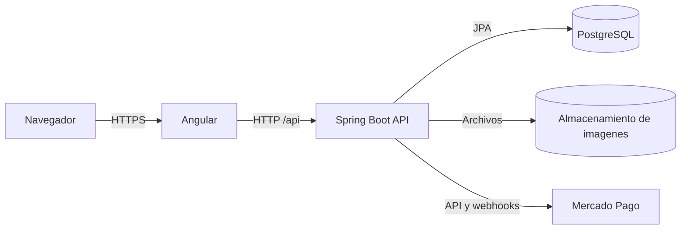
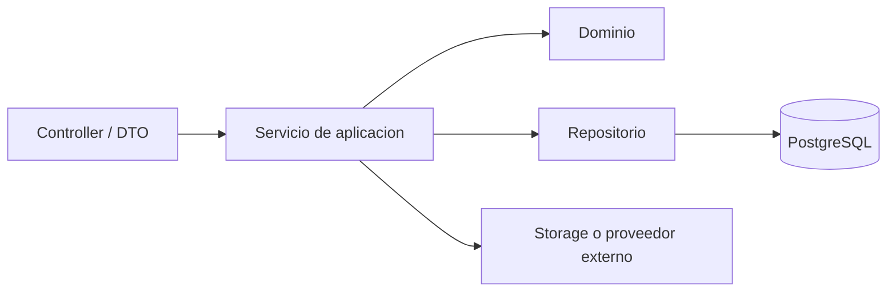

# Pinatech

Pinatech es una tienda de productos informaticos con gestion de catalogo, inventario, pedidos, pagos y servicio tecnico. El sistema adopta una arquitectura de monolito modular con un frontend Angular, una API Spring Boot y persistencia en PostgreSQL.

## Stack tecnologico

| Capa | Tecnologia | Version |
|---|---|---:|
| Frontend | Angular | 21.2.20 |
| Runtime frontend | Node.js | 24.15.0 |
| Backend | Spring Boot | 3.5.16 |
| Runtime backend | Java | 21 LTS |
| Base de datos | PostgreSQL | 17.10 |

## Contexto del sistema



Angular concentra la presentacion y el estado de interfaz. Spring Boot implementa las reglas de negocio, autorizacion, integraciones y acceso a datos. PostgreSQL conserva el estado transaccional y Flyway controla la evolucion del esquema.

## Frontend

El frontend es una aplicacion Angular standalone organizada por responsabilidad:

```text
frontend/src/app/
├── core/       # Estado global, autenticacion, guards, interceptores y servicios base
├── features/   # Pantallas y logica agrupadas por capacidad de negocio
├── shared/     # Componentes reutilizables entre capacidades
├── app.routes.ts
├── app.config.ts
└── app.ts
```

Las rutas cargan sus componentes de forma diferida. Los guards mejoran el flujo de navegacion segun el rol, pero no constituyen una frontera de seguridad; toda autorizacion se vuelve a comprobar en la API.

Las capacidades principales son:

- `home`, `catalog` y `product`: descubrimiento y consulta de productos.
- `cart`, `checkout`, `checkout-result` y `orders`: proceso de compra y seguimiento.
- `auth` y `profile`: identidad y datos del usuario.
- `tickets` y `technical`: solicitudes y operacion del servicio tecnico.
- `admin`: catalogo, inventario, pedidos y asignaciones administrativas.

## Backend

El backend es un monolito modular. Cada capacidad agrupa sus controladores, servicios, entidades, repositorios y DTOs bajo `com.computerstore`.

```text
backend/src/main/java/com/computerstore/
├── auth/        # Inicio, renovacion y cierre de sesion
├── profile/     # Perfil, direccion y cambios sensibles de cuenta
├── user/        # Usuarios y roles
├── email/       # Verificacion, recuperacion y correo transaccional
├── catalog/     # Productos, categorias, marcas, variantes e imagenes
├── inventory/   # Stock disponible, reservas y movimientos
├── order/       # Pedidos, vencimientos y transiciones de estado
├── payment/     # Checkout, webhooks y conciliacion de pagos
├── service/     # Tickets, historial, asignacion y adjuntos
├── storage/     # Persistencia local de archivos
├── security/    # JWT, filtros y contexto autenticado
├── config/      # Configuracion transversal
├── common/      # Errores y utilidades compartidas
└── health/      # Estado de la API
```

La direccion general de dependencias es:



Los controladores exponen DTOs y no entidades JPA. Los servicios delimitan las operaciones de negocio y sus transacciones. Los repositorios encapsulan la persistencia.

## Modulos de dominio

### Identidad y seguridad

Spring Security protege los recursos de la API. Los access tokens JWT de corta duracion se mantienen en memoria en el frontend. La renovacion usa refresh tokens rotativos enviados mediante cookies `HttpOnly`; en persistencia solo se conservan sus hashes. Los cambios de email y contrasena invalidan todas las sesiones mediante una version por cuenta.

La verificacion de email, recuperacion de contrasena y confirmacion de cambios usan tokens aleatorios de un solo uso almacenados solamente como hash.

Los roles principales son cliente, tecnico y administrador. La API aplica autorizacion por endpoint y por propiedad del recurso.

### Catalogo e inventario

El catalogo modela productos, especificaciones, imagenes y variantes de color. Cada variante se vincula con inventario disponible y reservado. Los movimientos de inventario conservan trazabilidad y el stock exacto se restringe a los roles operativos.

### Pedidos

Los pedidos conservan snapshots del nombre y precio del producto para no depender de cambios posteriores en el catalogo. El backend recalcula los importes y nunca confia en precios enviados por el navegador.

La creacion admite una clave de idempotencia. El stock se reserva durante una ventana temporal; un proceso programado cancela pedidos vencidos y libera sus unidades.

### Pagos

El modulo de pagos aisla la integracion con Mercado Pago mediante un gateway. El checkout crea una preferencia asociada al pedido y registra cada intento. Los webhooks se validan y luego se consulta al proveedor antes de modificar el estado local.

La conciliacion y los reembolsos son idempotentes. Un retorno del navegador informa al usuario, pero no constituye confirmacion autoritativa del pago.

### Servicio tecnico

Los clientes crean tickets y consultan su seguimiento. Administradores asignan tecnicos y los tecnicos gestionan prioridad, diagnostico, presupuesto, estado e historial. Cada transicion queda registrada con fecha, autor y comentario opcional.

### Archivos

Las imagenes se validan por contenido, se renombran con UUID y se abstraen mediante el modulo de almacenamiento. Las imagenes de productos son publicas; los adjuntos de tickets se descargan mediante endpoints autenticados con controles de propiedad y rol.

## Persistencia

Flyway es la unica fuente de cambios del esquema. Hibernate usa `ddl-auto: validate`, por lo que comprueba el modelo pero no crea ni altera tablas.

- Las fechas de auditoria se almacenan como `TIMESTAMPTZ` en UTC.
- Los importes usan `NUMERIC(19,2)` en PostgreSQL y `BigDecimal` en Java.
- Las operaciones de stock, pedidos y pagos se ejecutan dentro de limites transaccionales.
- Los archivos se almacenan fuera de PostgreSQL y la base conserva sus metadatos.

## Topologias de despliegue

El repositorio admite tres topologias sin cambiar la separacion logica del sistema:

- Desarrollo: Angular servido por Nginx, Spring Boot con perfil `dev` y PostgreSQL local aislado.
- Cloud: Angular en Vercel, Spring Boot en Railway, PostgreSQL en Supabase y almacenamiento persistente en Railway.
- VPS: Caddy como entrada HTTPS, contenedores de frontend y backend, PostgreSQL y redes separadas para aplicacion y datos.

En todos los casos, el navegador accede a la API mediante `/api`; el frontend no contiene credenciales de proveedores ni acceso directo a la base de datos.

## Estructura del repositorio

```text
Pinatech/
├── frontend/                 # Aplicacion Angular
├── backend/                  # API Spring Boot
├── docs/                     # Decisiones y documentacion tecnica
├── ops/                      # Configuracion operativa
├── docker-compose.yml        # Topologia con servicios externos configurables
├── docker-compose.dev.yml    # Topologia local aislada
├── docker-compose.prod.yml   # Topologia de produccion en VPS
├── CONTRIBUTING.md
└── README.md
```

## Decisiones principales

- El monolito modular reduce la complejidad operativa sin mezclar las capacidades de negocio.
- PostgreSQL se ajusta al dominio relacional y a sus requisitos transaccionales.
- Flyway controla de forma explicita y reproducible la evolucion del esquema.
- Los DTOs separan el contrato HTTP del modelo de persistencia.
- La seguridad del backend es la frontera autoritativa; Angular solo adapta la experiencia.
- Los precios se recalculan en el backend y los pedidos conservan snapshots historicos.
- Reservas, pagos, webhooks y reembolsos usan mecanismos de idempotencia.
- El almacenamiento de archivos esta desacoplado para permitir una futura migracion a object storage.

Las decisiones iniciales se documentan en [`docs/architecture.md`](docs/architecture.md). La arquitectura de pagos se amplia en [`docs/payment-and-shipping-integration.md`](docs/payment-and-shipping-integration.md).
