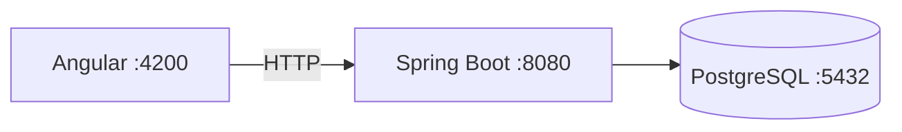

# Computer Store

MVP local de una tienda de productos informaticos y servicio tecnico. El proyecto demuestra una arquitectura de monolito modular con Angular, Spring Boot y PostgreSQL.

## Estado

La Etapa 1 esta implementada: infraestructura local, esquema inicial, Flyway, Swagger, manejo global de errores y comprobacion de conectividad Angular/API.

## Stack

| Technology | Version |
|---|---:|
| Java | 21 LTS |
| Spring Boot | 3.5.16 |
| Angular | 21.2.18 |
| Node.js | 24.15.0 |
| PostgreSQL | 17.10 |

## Architecture



See [docs/architecture.md](docs/architecture.md) for the initial architecture decisions.

## Repository structure

```text
computer-store/
├── frontend/       # Angular standalone application
├── backend/        # Spring Boot API
├── docs/           # Technical documentation
├── docker-compose.yml
├── .env.example
├── README.md
└── CONTRIBUTING.md
```

## Prerequisites

- Docker Desktop with Docker Compose.
- Java 21 LTS.
- Node.js 24.15.0 and npm 11.12.1.

Windows Java installation:

```powershell
winget install --id EclipseAdoptium.Temurin.21.JDK -e
java -version
```

Linux (Debian/Ubuntu):

```bash
sudo apt update
sudo apt install openjdk-21-jdk
java -version
```

## Local startup with Docker

Docker Compose starts PostgreSQL and the backend. Environment defaults are safe only for local development.

```bash
docker compose up -d --build
docker compose ps
```

```powershell
docker compose up -d --build
docker compose ps
```

The API is available at `http://localhost:8080/api/health` and Swagger is available at `http://localhost:8080/swagger-ui/index.html`.

## Manual startup

1. Copy `.env.example` to `.env` and adjust local values if necessary.
2. Start PostgreSQL only:

```bash
docker compose up -d postgres
```

```powershell
docker compose up -d postgres
```

3. Start the backend:

```bash
cd backend
./mvnw spring-boot:run
```

```powershell
cd backend
.\mvnw.cmd spring-boot:run
```

4. Start Angular in a second terminal:

```bash
cd frontend
npm install
npm start
```

```powershell
cd frontend
npm install
npm start
```

Open `http://localhost:4200`. The home page checks `GET /api/health` through the real API.

## Database and Flyway

Flyway executes `backend/src/main/resources/db/migration/V1__create_initial_schema.sql` automatically from an empty database. Hibernate is configured with `ddl-auto: validate`; it never creates or changes the schema.

To reset local data, stop and remove the PostgreSQL volume:

```bash
docker compose down -v
docker compose up -d --build
```

```powershell
docker compose down -v
docker compose up -d --build
```

## Verification

Backend:

```bash
cd backend
./mvnw clean verify
```

Windows:

```powershell
cd backend
.\mvnw.cmd clean verify
```

Frontend:

```bash
cd frontend
npm install
npm test -- --watch=false
npm run build
```

## Security baseline

- No real credentials or secrets are versioned.
- CORS permits only `http://localhost:4200` by default.
- Swagger and health are public during this bootstrap stage; all other endpoints are denied.
- Error responses use RFC 9457 `ProblemDetail` without stack traces.
- Future authentication will use short-lived JWT access tokens and refresh tokens in `HttpOnly` cookies.

## Architecture decisions

- A modular monolith reduces operational complexity for the MVP.
- Backend code is organized by feature.
- PostgreSQL fits the relational domain.
- Flyway owns schema changes.
- Prices will always be recalculated on the backend.
- Orders will retain product name and price snapshots.
- Inventory movements will retain traceability.
- Spring Security protects API endpoints; Angular guards are not a security boundary.
- Passwords will be stored using secure hashes only.

## Roadmap

- Etapa 2: authentication, roles and JWT refresh flow.
- Etapa 3: catalog, products, inventory and seed data.
- Etapa 4: cart and order management.
- Etapa 5: technical service tickets.
- Etapa 6: full test suite, CI and visual polish.

## Screenshots

`TODO`: Add screenshots after the catalog and administration screens are available.

## Team

- Add project members here.
