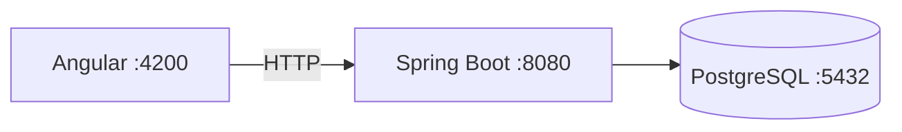

# Computer Store

MVP local de una tienda de productos informaticos y servicio tecnico. El proyecto demuestra una arquitectura de monolito modular con Angular, Spring Boot y PostgreSQL.

## Estado

El MVP funcional esta implementado: autenticacion con roles y refresh tokens rotativos, catalogo, inventario, ordenes y tickets de servicio tecnico. Incluye pruebas unitarias para la logica de autenticacion, stock, transiciones de orden y guards de Angular.

## Stack

| Technology | Version |
|---|---:|
| Java | 21 LTS |
| Spring Boot | 3.5.16 |
| Angular | 21.2.18 |
| Node.js | 24.15.0 |
| PostgreSQL | 17.10 |

## Architecture



See [docs/architecture.md](docs/architecture.md) for the initial architecture decisions.

## Repository structure

```text
computer-store/
├── frontend/       # Angular standalone application
├── backend/        # Spring Boot API
├── docs/           # Technical documentation
├── docker-compose.yml
├── .env.example
├── README.md
└── CONTRIBUTING.md
```

## Prerequisites

- Docker Desktop with Docker Compose.
- Java 21 LTS.
- Node.js 24.15.0 and npm 11.12.1.

Windows Java installation:

```powershell
winget install --id EclipseAdoptium.Temurin.21.JDK -e
java -version
```

Linux (Debian/Ubuntu):

```bash
sudo apt update
sudo apt install openjdk-21-jdk
java -version
```

## Local startup with Docker

Docker Compose starts PostgreSQL and the backend. Environment defaults are safe only for local development.

```bash
docker compose up -d --build
docker compose ps
```

```powershell
docker compose up -d --build
docker compose ps
```

The API is available at `http://localhost:8080/api/health` and Swagger is available at `http://localhost:8080/swagger-ui/index.html`.

## Manual startup

1. Copy `.env.example` to `.env` and adjust local values if necessary.
2. Start PostgreSQL only:

```bash
docker compose up -d postgres
```

```powershell
docker compose up -d postgres
```

3. Start the backend:

```bash
cd backend
./mvnw spring-boot:run
```

```powershell
cd backend
.\mvnw.cmd spring-boot:run
```

4. Start Angular in a second terminal:

```bash
cd frontend
npm install
npm start
```

```powershell
cd frontend
npm install
npm start
```

Open `http://localhost:4200`. The home page checks `GET /api/health` through the real API.

## Database and Flyway

Flyway executes `backend/src/main/resources/db/migration/V1__create_initial_schema.sql` automatically from an empty database. Hibernate is configured with `ddl-auto: validate`; it never creates or changes the schema.

To reset local data, stop and remove the PostgreSQL volume:

```bash
docker compose down -v
docker compose up -d --build
```

```powershell
docker compose down -v
docker compose up -d --build
```

## Verification

Backend:

```bash
cd backend
./mvnw clean verify
```

Windows:

```powershell
cd backend
.\mvnw.cmd clean verify
```

Frontend:

```bash
cd frontend
npm install
npm test -- --watch=false
npm run build
```

## Security baseline

- No real credentials or secrets are versioned.
- CORS permits only `http://localhost:4200` by default.
- Catalog, health y autenticacion son publicos; los demas endpoints requieren autenticacion y el stock exacto solo esta disponible para administradores y tecnicos.
- Error responses use RFC 9457 `ProblemDetail` without stack traces.
- Access tokens de corta duracion se mantienen solo en memoria; el frontend renueva la sesion una vez ante un 401 usando refresh tokens rotativos en cookies `HttpOnly`.
- Login y refresh tienen limites de intentos en memoria configurables mediante `AUTH_MAX_LOGIN_ATTEMPTS`, `AUTH_MAX_REFRESH_ATTEMPTS` y `AUTH_RATE_LIMIT_WINDOW_MS`.

## Development users

These accounts are seeded only in the `dev` profile. Do not use their passwords outside local development.

| Role | Email | Password |
|---|---|---|
| Administrator | `admin@computerstore.local` | `Admin123!` |
| Technician | `technician@computerstore.local` | `Technician123!` |
| Customer | `customer@computerstore.local` | `Customer123!` |

## Architecture decisions

- A modular monolith reduces operational complexity for the MVP.
- Backend code is organized by feature.
- PostgreSQL fits the relational domain.
- Flyway owns schema changes.
- Los precios se recalculan siempre en el backend.
- Las ordenes retienen snapshots de nombre y precio del producto.
- Los movimientos de inventario retienen trazabilidad.
- Spring Security protects API endpoints; Angular guards are not a security boundary.
- Las contrasenas se almacenan usando BCrypt y los refresh tokens se almacenan como hashes SHA-256.

## Roadmap

- Etapa 2: authentication, roles and JWT refresh flow. Implementada.
- Etapa 3: catalog, products, inventory and seed data. Implementada.
- Etapa 4: cart and order management. Implementada.
- Etapa 5: technical service tickets. Implementada.
- Etapa 6: ampliar pruebas de integracion, linting y pulido visual. En progreso.

## Screenshots

Pendiente de incorporar capturas actualizadas del catalogo, administracion y servicio tecnico.

## Team

- Pendiente de completar por el equipo del proyecto.
