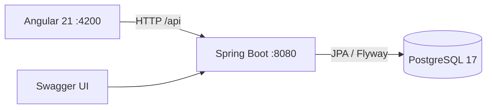

# Arquitectura inicial

El sistema comienza como un monolito modular. Cada capacidad de negocio tendra su propio
paquete de dominio, repositorio, servicio, controlador y DTOs cuando sea necesario.

## Reglas iniciales

- Flyway es la unica fuente para cambios de esquema.
- Hibernate valida el esquema, no lo modifica.
- Las fechas de auditoria se almacenan como `TIMESTAMPTZ` en UTC.
- Los importes se almacenan como `NUMERIC(19,2)` y se representaran con `BigDecimal`.
- Las APIs exponen DTOs, nunca entidades JPA.
- La seguridad de los recursos se implementara en el backend; los guards de Angular seran solo una ayuda de navegacion.
